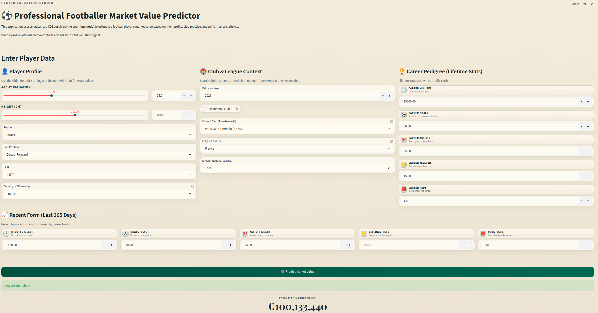

<h1 align="center">Football Player Market Value Prediction</h1>

<p align="center">
  <a href="https://player-market-value-prediction.streamlit.app/">
    
  </a>
  
  
  
</p>

<p align="center">
  Author: <strong>Khaled Blel</strong>
</p>

<p align="center">
  End-to-end machine learning project for predicting professional football player market values,
  from data preparation and EDA to model benchmarking and deployed inference with Streamlit.
</p>

---

## Table of Contents

| Section | Description |
|---|---|
| [About](#about) | Project scope and objective |
| [Live Application](#live-application) | Deployed Streamlit link |
| [Dataset](#dataset) | Data files and source |
| [Methodology](#methodology) | Pipeline and modeling approach |
| [Results](#results) | Model comparison and champion model |
| [Screenshot](#screenshot) | App preview image |
| [Repository Structure](#repository-structure) | Project organization |
| [Notebook Guide](#notebook-guide) | Recommended execution order |
| [Installation and Usage](#installation-and-usage) | Setup and run instructions |
| [License](#license) | Project license |

---

## About

This project addresses a supervised regression problem: estimating football player market value in EUR from player profile, club context, league context, and performance indicators.

The repository includes:
- A complete notebook workflow for preparation, analysis, and modeling.
- A production-ready preprocessing pipeline and champion model.
- A deployed Streamlit app for interactive predictions.

## Live Application

Deployed app (URL subject to change):
- https://player-market-value-prediction.streamlit.app/

If the hosted link changes, run the app locally using the command in the Installation and Usage section.

## Dataset

Local data files:
- data/eda_final_dataset.csv
- data/processed_valuations.csv

Dataset source:
- https://www.kaggle.com/datasets/davidcariboo/player-scores

## Methodology

The modeling workflow in notebooks/02_Modeling.ipynb is built around:
- Time-based train/test splitting to reduce temporal leakage.
- Structured preprocessing:
  - Target Encoding for high-cardinality categorical variables.
  - One-Hot Encoding for low-cardinality categorical variables.
  - Scaling for numerical variables.
- Benchmarking multiple model families before champion selection.

## Results

Final benchmark metrics (from notebooks/02_Modeling.ipynb):

| Model | R2 | MAE (EUR) |
|---|---:|---:|
| XGBoost (Champion) | 0.8371 | 2,194,802 |
| LightGBM | 0.8344 | 2,147,641 |
| Random Forest | 0.7733 | 2,991,016 |
| Lasso Regression | 0.5640 | 4,630,556 |
| Ridge Regression | 0.5631 | 4,632,189 |

Deployed artifacts:
- models/xgboost_champion.joblib
- models/preprocessor.joblib

## Screenshot

<p align="center">
  
</p>

## Repository Structure

```text
.
|- data/
|  |- eda_final_dataset.csv
|  |- processed_valuations.csv
|- models/
|  |- preprocessor.joblib
|  |- xgboost_champion.joblib
|- notebooks/
|  |- 00_Data_Preparation.ipynb
|  |- 01_EDA.ipynb
|  |- 02_Modeling.ipynb
|- src/
|  |- app.py
|- requirements.txt
|- README.md
|- LICENSE
|- .gitignore
```

## Notebook Guide

Run notebooks in this order:

| Notebook | Purpose |
|---|---|
| notebooks/00_Data_Preparation.ipynb | Data loading, cleaning, and feature preparation |
| notebooks/01_EDA.ipynb | Exploratory analysis and feature understanding |
| notebooks/02_Modeling.ipynb | Preprocessing, training, tuning, and evaluation |

## Installation and Usage

### 1) Clone the repository

```bash
git clone https://github.com/Khaledblel/player-market-value-prediction.git
cd player-market-value-prediction
```

### 2) Create and activate a virtual environment (recommended)

```bash
python -m venv .venv
source .venv/bin/activate
```

### 3) Install dependencies

```bash
pip install -r requirements.txt
```

### 4) Run notebooks

```bash
jupyter notebook
```

### 5) Run the Streamlit app

```bash
cd src
python3 -m streamlit run app.py
```

## License

This project is licensed under the MIT License. See LICENSE for details.
